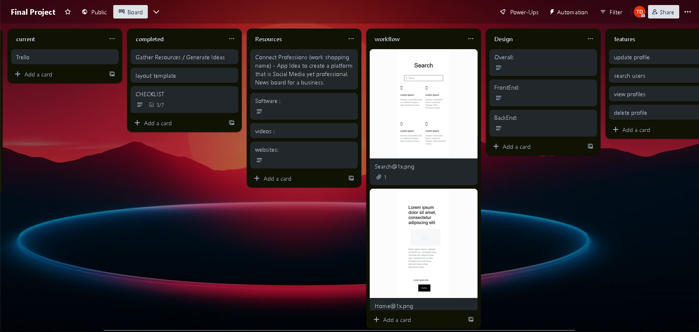
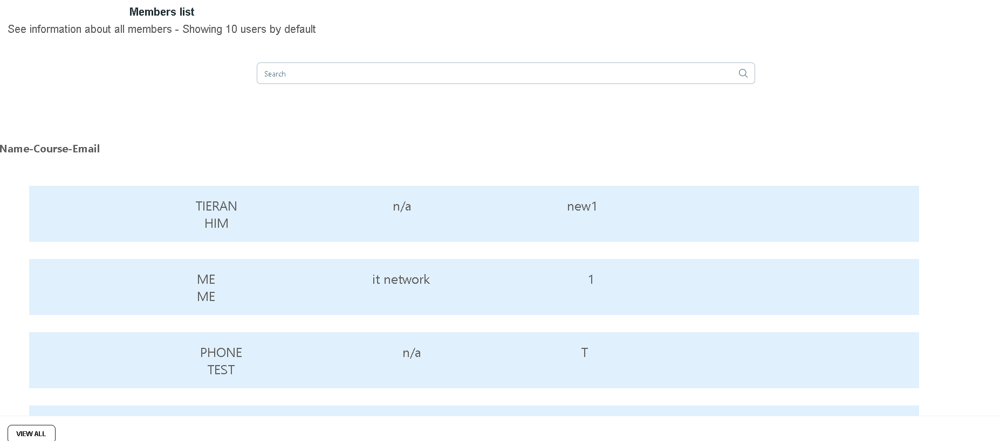

# Welcome to Connect Profession

## A central database to find like minded tech professionals and connect! With Connect Professions you sign up with an account. With that account you gain access to our database you can connect or get in contact with others. With the main feed you will see current events that are happening in the community. Also gain access to tech , business, and science articles. With each individual profile you gain sumbit your links github, linkedin, portfolio, email, etc. update information about yourself. Once complete head over to the search page and search for users and click to view their profile and connect!   This is not completed as it is a platform that can take on many features. I wanted to create something responsive and simple using the tools taught in this class. 

# Tech Used 
## I wanted to use news apis but since I wanna had the feature of an auth user who can create events I want them also have the ability to add news to the news feed. So for the project I just hard coded to data objects to fill the data.
## As far as libraries this was most of them (IF YOU LOOK CLOSELY YOU CAN SEE CLOUDINARY MULTIPLE TIMES... ran into issuse with that will discuss in unsolved section)
    
    "@cloudinary/react": "^1.11.2",
    "@cloudinary/url-gen": "^1.11.2",
    "@emotion/react": "^11.11.1",
    "@emotion/styled": "^11.11.0",
    "@headlessui/react": "^1.7.17",
    "@heroicons/react": "^2.0.18",
    "@material-tailwind/react": "^2.1.1",
    "@mui/material": "^5.14.7",
    "@reduxjs/toolkit": "^1.9.5",
    "@types/react": "^18.2.15",
    "@types/react-dom": "^18.2.7",
    "@vitejs/plugin-react": "^4.0.3",
    "autoprefixer": "^10.4.15",
    "axios": "^1.5.0",
    "cloudinary": "^1.40.0",
    "cors": "^2.8.5",
    "eslint": "^8.45.0",
    "eslint-plugin-react": "^7.32.2",
    "eslint-plugin-react-hooks": "^4.6.0",
    "eslint-plugin-react-refresh": "^0.4.3",
    "express-fileupload": "^1.4.0",
    "framer-motion": "^10.16.2",
    "jwt-decode": "^3.1.2",
    "multer": "^1.4.5-lts.1",
    "postcss": "^8.4.29",
    "preline": "^1.9.0",
    "react": "^18.2.0",
    "react-dom": "^18.2.0",
    "react-redux": "^8.1.2",
    "react-router-dom": "^6.15.0",
    "rippleui": "^1.12.1",
    "tailwindcss": "^3.3.3",
    "tw-elements-react": "^1.0.0-alpha1",
    "vite": "^4.4.5"

# LINKS 
THE READ ME

Deployed Website FRONT - [https://fp-front-uiqa.onrender.com]

Deployed Website FRONT - [https://fp-server-ox4k.onrender.com]

Trello - https://trello.com/b/Kzxxo2IA

# Unresolved Issues 

- Cloudinary could not get the uploading to work tried multiple ways in the front end , back end , making a call to cloudinary api and I kept getting an error but the image path does save. 
- Since I am unable to get cloudinary working seeing the images is not a feature in the website